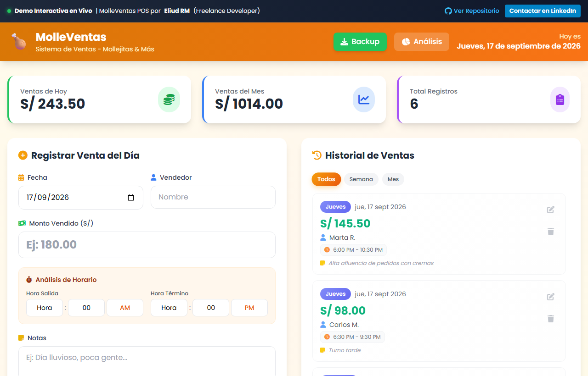
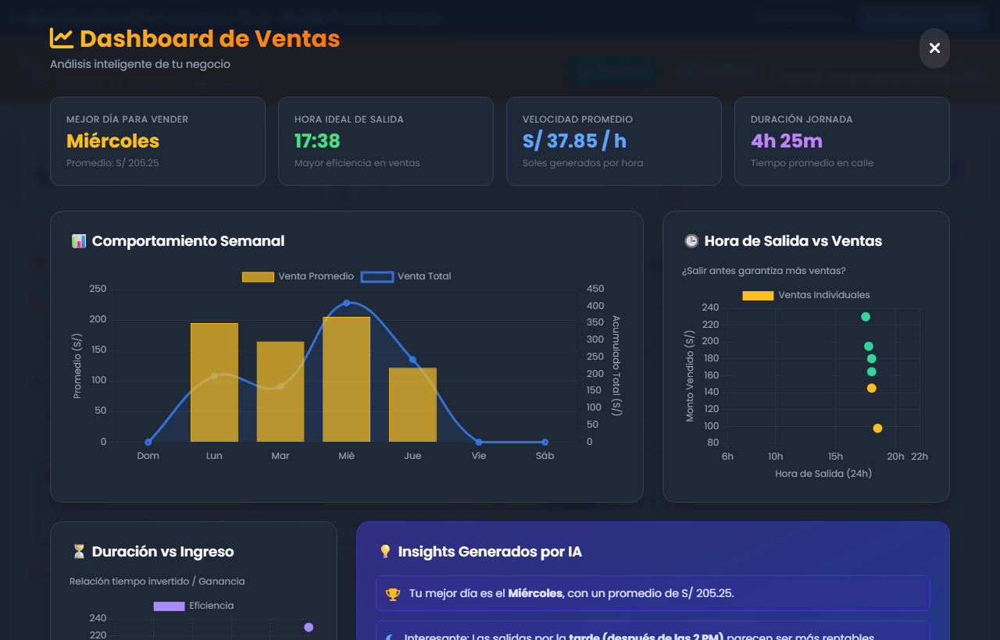

# 🍗 MolleVentas — Sistema Web POS & Analítica Comercial para Gastronomía y Retail
> **Digitalización de ventas diarias, control de turnos y analítica en tiempo real para negocios gastronómicos y comercios.**

  
  

  
  

---

## 📌 El Desafío de Negocio

Muchos negocios de comida rápida, puestos de venta y pequeños comercios minoristas operan con anotaciones en cuadernos o memorias de cálculo manuales al cierre de cada jornada:
- **Descuadres de caja diarios** y falta de conciliación de turnos entre diferentes vendedores.
- **Cero visibilidad analítica** sobre qué días de la semana y qué franjas horarias generan el mayor retorno real.
- **Pérdida de insumos** por compras mal calculadas al desconocer la velocidad real de rotación de productos.
- **Barrera de costos**: Los softwares POS del mercado exigen pagos mensuales elevados, terminales caras y configuraciones complejas que no se ajustan a la realidad de negocios dinámicos.

---

## 💡 La Solución Implementada

**MolleVentas** fue diseñado desde cero como una **solución de punto de venta (POS) ligera, responsive y sin costes de suscripción**, operable directamente desde cualquier smartphone o tablet en el mostrador del negocio.

Combina un módulo ultra rápido de cobro y registro diario con un **dashboard ejecutivo de Business Intelligence integrado**:
1. Registrar ventas al instante con fecha, vendedor, turno y notas de operación.
2. Supervisar métricas financieras consolidadas (ventas del día, acumulado mensual, ticket promedio).
3. Analizar mediante gráficos interactivos (`Chart.js`) la productividad por hora, la distribución por días de la semana y la velocidad de venta.

👉 **[Prueba la Demo Interactiva en Vivo aquí](https://enybyy.github.io/pos-sales-management-system/)**

---

## 📈 Impacto y Mejoras Conseguidas

| Métrica / Área | Antes de la Solución | Con MolleVentas | Impacto de Negocio |
|---|---|---|---|
| **Cierre de Caja y Cuadre** | 30 a 45 min diarios en cuadernos con tachaduras | Instantáneo (en 1 clic) | **Ahorro de ~20 horas al mes** para el dueño del negocio |
| **Trazabilidad por Vendedor** | Sin registro formal de turnos ni responsables | Registro de vendedor, hora inicio y fin por jornada | **100% de transparencia** en la administración de personal |
| **Aprovisionamiento de Insumos** | Estimaciones por intuición | Decisiones basadas en días pico y velocidad de venta | **Reducción de mermas de insumos perecibles** |
| **Costo de Software** | Planes mensuales de $30 - $70 USD/mes | Solución propia sin suscripciones | **Ahorro recurrente garantizado** |

---

## ✨ Funcionalidades Principales

- **Registro Rápido de Ventas**: Ingreso ágil de monto en soles (S/), fecha, vendedor, horarios de turno y observaciones de caja.
- **Historial Interactivo con Filtros**: Segmentación por: *Todos*, *Esta Semana*, *Este Mes*.
- **Gestión Completa (CRUD)**: Edición rápida o eliminación con confirmación.
- **Dashboard Analítico Avanzado**:
  - **Distribución por Día de la Semana**: Gráfico de barras comparativo para identificar días de mayor rentabilidad.
  - **Horas Pico**: Mapa de impacto para optimizar preparación y personal en horas de alta demanda.
  - **Velocidad de Venta y Turnos**: Métricas de eficiencia operativa.
- **100% Responsive & Touch-Friendly**: Adaptado para trabajar cómodamente en teléfonos móviles, tablets o pantallas táctiles de mostrador.

---

## 🛠️ Stack Tecnológico

- **HTML5 Semántico**: Estructura limpia y accesible.
- **Tailwind CSS & Custom CSS**: Interfaz moderna, rápida y adaptable.
- **JavaScript ES6+**: Lógica reactiva en cliente y persistencia local (`localStorage`).
- **Chart.js**: Renderizado dinámico de gráficos estadísticos.

---

## 📬 ¿Necesitas una solución similar para tu negocio?

Desarrollo **sistemas web a medida, soluciones POS personalizadas, paneles de administración y dashboards analíticos**.

- **LinkedIn**: [Eliud RM](https://www.linkedin.com/in/eliud-rm/)
- **GitHub**: [@Enybyy](https://github.com/Enybyy)
- *Disponible para proyectos freelance y consultoría tecnológica.*
