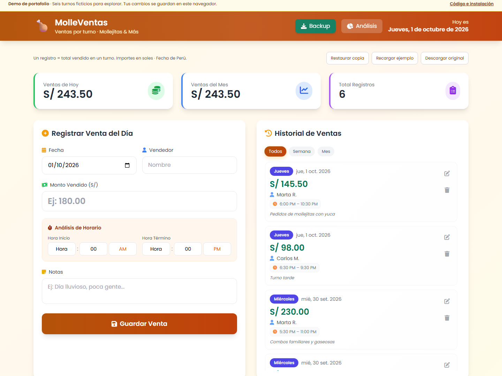
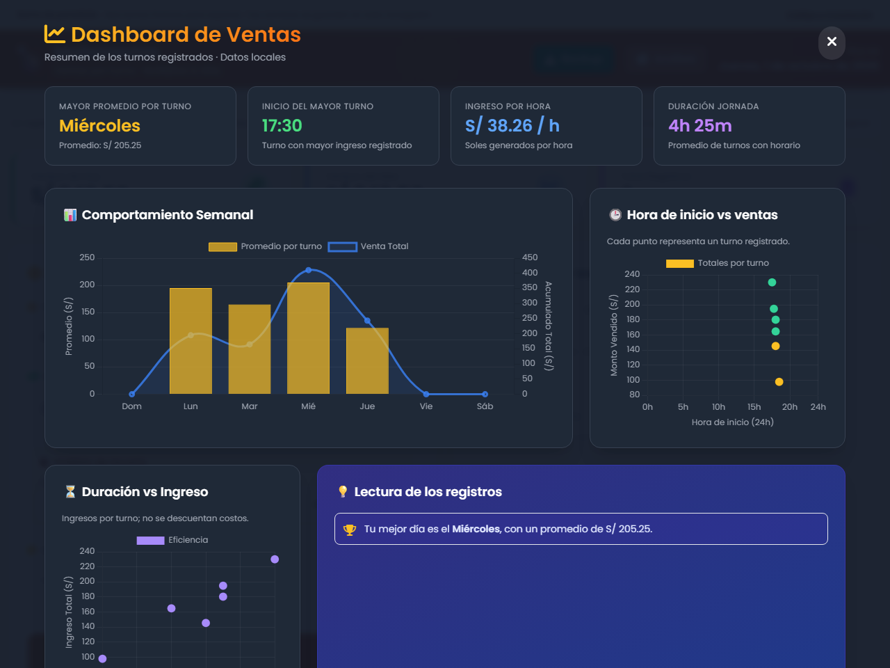

<div align="center">

# MolleVentas

Shift sales records in Peruvian soles, with history, descriptive analysis and JSON backups.

<a href="https://enybyy.github.io/pos-sales-management-system/"></a>

<p><a href="https://github.com/Enybyy"></a>
<a href="https://www.linkedin.com/in/eliud-rojas-mendoza-414652212/"></a>
<a href="https://www.upwork.com/freelancers/~01471ca462b236e8e5"></a></p>

[](https://enybyy.github.io/pos-sales-management-system/)

*Actual prototype screenshot with fictional sales. Each record represents the total for one shift.*

[About](#about-the-project) · [Workflow](#everyday-workflow) · [Technology](#built-with) · [Run locally](#local-use)

</div>


## About the project

At a food stall, closing a shift leaves a sales total, a seller and sometimes working hours or a note. MolleVentas keeps those details in an editable history, so daily, weekly and monthly views all start from the same records.

Analysis lets users review revenue and shift duration without preparing another spreadsheet for each comparison. JSON backups preserve browser data and allow it to be restored. Each entry represents a shift total; the app concentrates on this record rather than inventory or receipt issuance.

## Everyday workflow

| Inside the project | Detail |
| --- | --- |
| Shift record | Date, amount and seller, with optional hours and notes. |
| Editable history | Period filters, editing and record deletion. |
| Descriptive analysis | Compare days, shift duration and revenue per hour. |
| Amount calculations | Integer-cent totals and business dates in America/Lima. |
| Backups | JSON export and validated restoration in the browser. |

## Screenshots

### Analysis of recorded shifts



## Explore the demo

The interface uses Spanish labels:

1. First use loads six fictional shifts with dates near the current day in Peru.
2. Enter a date, amount and seller. Hours and notes are optional; if adding hours, provide both start and end.
3. Use **Todos** (All), **Semana** (Week) or **Mes** (Month) to filter history. Edit or delete records with their controls.
4. Open **Análisis** (Analysis) to compare days, revenue per hour and shift duration.
5. **Backup** downloads all sales as JSON. **Restaurar copia** (Restore backup) validates a file and requests confirmation before replacing data.
6. **Recargar ejemplo** (Reload example) replaces changes with six fictional shifts after confirmation. Download a backup first to retain your records.

Each record is the **total sold during one shift**, not a product line or receipt. A shift from 23:00 to 01:30 lasts 2 h 30 min and belongs to its starting date.

## What is included

- Create, edit and delete sales, persisted in `localStorage`.
- Positive amounts with up to two decimal places and totals calculated in cents.
- Business dates in `America/Lima`, with Monday–Sunday weeks.
- Revenue per hour = revenue from timed shifts / total hours of those shifts.
- Daily averages calculated per record. Observations describe the sample without claiming causality, profit or predictions.
- JSON backups, validated restoration and preservation of the original stored content when invalid data is detected.
- The original amber/Poppins design, accessible controls and keyboard navigation.

## Prototype scope

The demo runs in a browser and retains changes on that origin and device. It has no accounts, backend, cross-device synchronization, inventory, receipt issuance, payment processing or bank reconciliation. Clearing browser data removes local records; export backups when exploring your own information.

Demo figures are fictional and do not represent measured time savings or business results. Analysis uses deterministic JavaScript calculations and Chart.js.

## Built with

| Area | Technology |
| --- | --- |
| Interface | HTML, CSS, Tailwind and JavaScript |
| Charts | Chart.js |
| Persistence | localStorage and JSON backups |
| Assets | Locally bundled fonts and icons |
| Verification | Node.js and Playwright |

## Local use

<details>
<summary><strong>Run on your computer</strong></summary>

No backend or package installation is needed to run the application. From the project folder:

```bash
python -m http.server 5084 --bind 127.0.0.1
```

Open `http://127.0.0.1:5084`. The folder can also be published on GitHub Pages. Styles, charts, icons and fonts are bundled locally; the application does not request external services.

</details>

<details>
<summary><strong>Code verification</strong></summary>

Business-rule tests require Node.js 18+ without dependency installation:

```bash
node --test tests/core.test.cjs
```

To repeat the 29 browser checks and capture the application:

```bash
npm install
npx playwright install chromium
# Keep the Python server running in another terminal.
npm run test:browser
```

The browser test uses an isolated temporary profile and fictional records, leaving your usual browser storage untouched. [Results and coverage](docs/verification.md).

</details>

<details>
<summary><strong>Files and portfolio assets</strong></summary>

| Path | Content |
| --- | --- |
| `index.html`, `css/style.css` | Interface and custom styles |
| `js/core.js` | Validation, dates, cents and examples |
| `js/app.js` | Forms, storage, history and backups |
| `js/analytics.js` | Metrics and charts |
| `tests/` | Rules and browser workflow |
| `assets/screenshots/` | Authentic GitHub and Upwork screenshots |
| `assets/vendor/`, `assets/webfonts/` | Local assets and third-party licenses |

- `assets/screenshots/upwork-molleventas-4x3.png`: 1440 × 1080, 4:3 view for Upwork.
- `assets/screenshots/screenshot-pos-main.png`: desktop form and history.
- `assets/screenshots/screenshot-pos-analytics.png`: analysis with actual prototype charts.

All images were captured from the running application with fictional records.

Tailwind CSS 3.4.17, Chart.js 4.4.9, Font Awesome Free 6.4.0 and Poppins are included locally, with licenses in `assets/vendor/`. [Presentation notes](docs/design.md).

</details>

---

<div align="center">

**Eliud Rojas Mendoza · Enybyy**

<p><a href="https://github.com/Enybyy"></a>
<a href="https://www.linkedin.com/in/eliud-rojas-mendoza-414652212/"></a>
<a href="https://www.upwork.com/freelancers/~01471ca462b236e8e5"></a></p>

</div>
